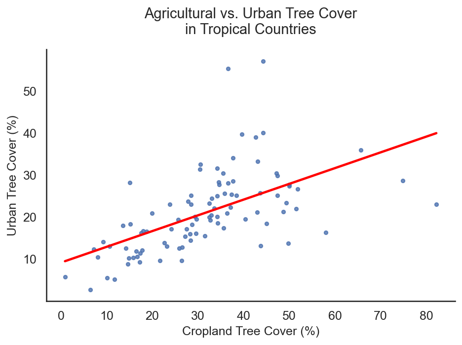
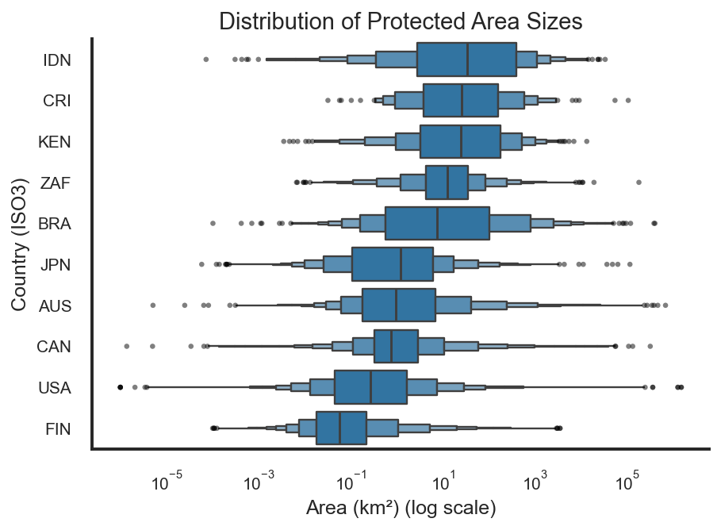
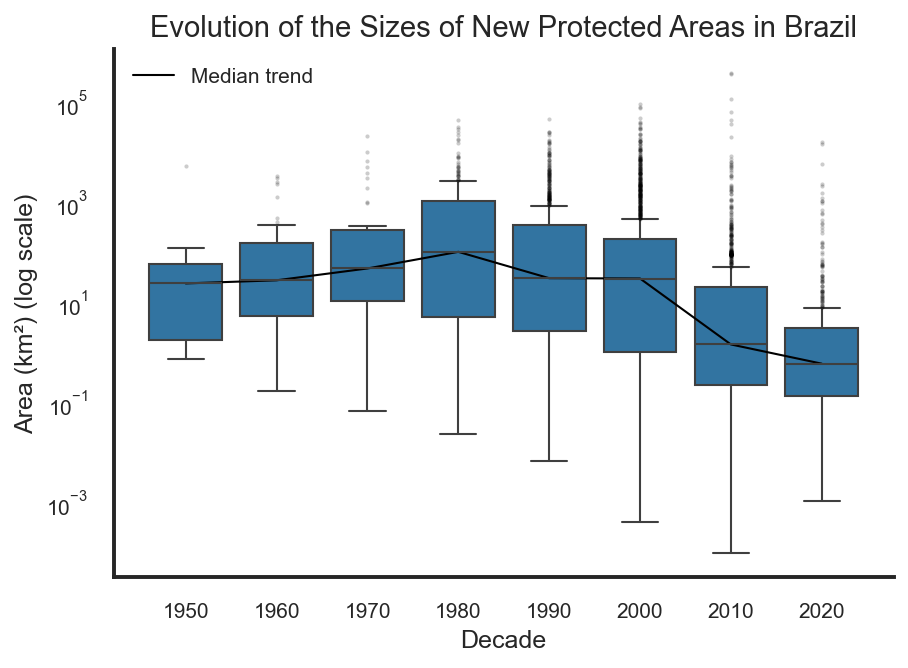
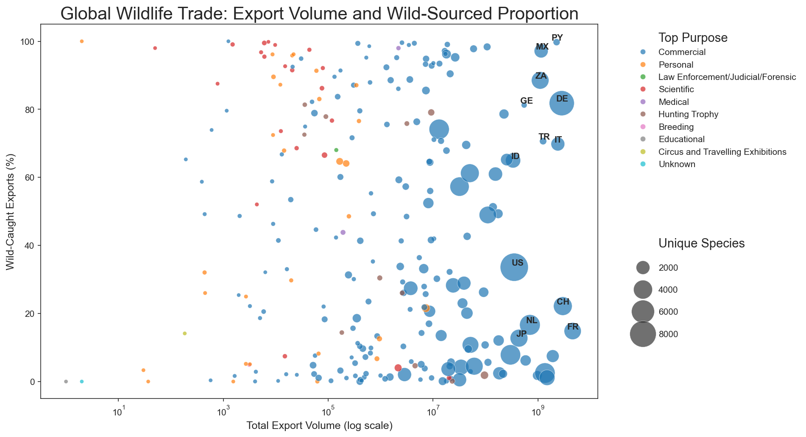
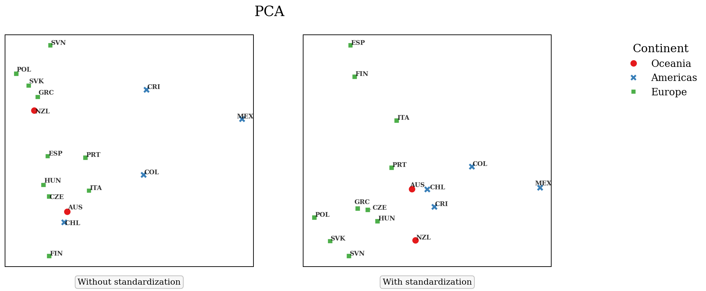
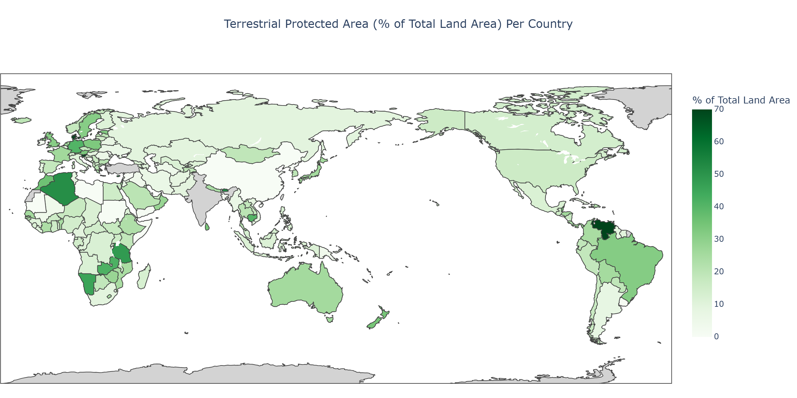
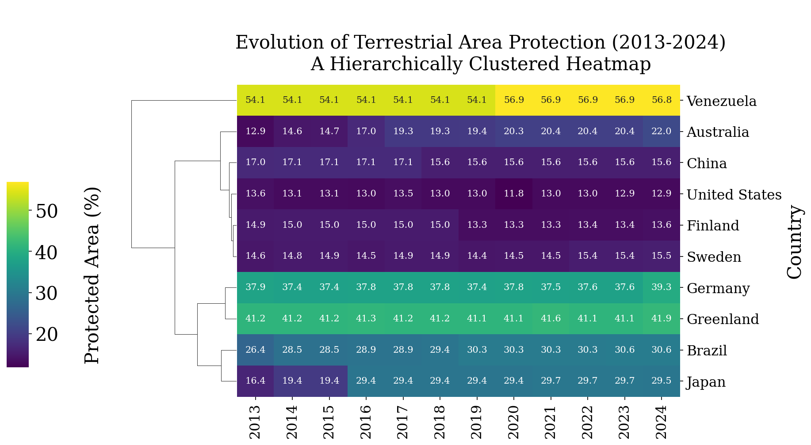
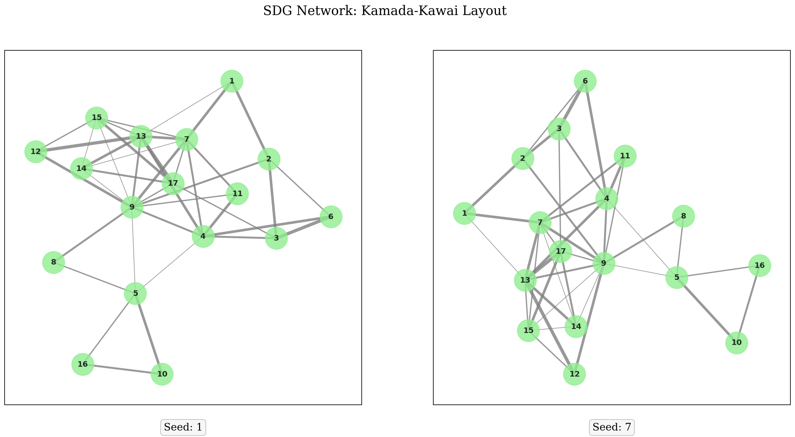

# Visualizing SDG 15: Life on Land

Eight notebooks about the UN's sustainable development goal 15, "life on land". Each one asks
something about land protection or biodiversity and uses a visualization technique that fits the
question.

I chose this goal because it's an interesting topic with large amounts of various data, and it can
be approached from many different angles. That turned out to be true. The notebooks cover
distributions, time series, a four variable scatter plot, choropleths, clustered heatmaps, three
dimensionality reduction methods and four network layouts.

Every notebook explains why the figure looks the way it does and not just how it was made. That is
the part I care about most, and it is most of the writing here. A few of them also end with what I
got wrong.

## Setup

```bash
uv sync
uv run jupyter lab
```

Or with pip:

```bash
pip install -r requirements.txt
jupyter lab
```

Every notebook is saved with its outputs, so all of it can be read on GitHub without running
anything. Three small datasets are in the repo. The two large ones are not, see
[`data/README.md`](data/README.md) for where to get them.

## The notebooks

**[1. Tree Cover on Cropland and in Cities](notebooks/01-tree-cover-correlation.ipynb)**

Does a country that keeps trees on its farmland keep them in its cities too? Somewhat, but the
correlation is only 0.573. The countries that don't fit the line are the interesting ones.



*pandas, seaborn, matplotlib*

**[2. How Big Are Protected Areas?](notebooks/02-protected-area-distributions.ipynb)**

The percentage of land a country protects hides how fragmented that land is. Indonesia, Costa Rica
and Kenya protect land in much larger pieces than Finland or the USA. The log scale also exposed
some clearly broken values in the source data.



*pandas, seaborn, matplotlib*

**[3. Brazil's Shrinking New Reserves](notebooks/03-protected-area-size-over-time.ipynb)**

New protected areas in Brazil have been getting smaller since the 1980's. Whether that is a bad
sign or just what happens once the large areas are already protected is not something this plot
can answer by itself.



*pandas, seaborn, matplotlib*

**[4. The Wildlife Trade in Four Dimensions](notebooks/04-wildlife-trade-multivariate.ipynb)**

Four variables per country in one scatter plot, aggregated from 27.9 million CITES trade records.
Paraguay, South Africa and Mexico export a lot of wildlife and most of it is caught from the wild.
Neither number on its own would have shown that.



*pandas, numpy, seaborn, matplotlib, adjustText*

**[5. PCA, MDS and t-SNE on SDG 15 Indicators](notebooks/05-dimensionality-reduction.ipynb)**

16 countries, 4 indicators and 10 different projections. Comparing them is the point. Without
standardization the Red List Index has almost no effect on the result, and t-SNE with a low
perplexity value invents groups that no other method agrees with.



*pandas, scikit-learn, seaborn, matplotlib, adjustText*

**[6. Two Ways to Color a Map](notebooks/06-protected-area-choropleths.ipynb)**

The same data drawn with a sequential colormap and then with a diverging one, compared against
Finland. The second map shows something the first one hides, but it can't be read without knowing
Finland's number.



*pandas, plotly, countryinfo*

**[7. Twelve Years of Protection, Ordered and Clustered](notebooks/07-protection-heatmap-clustermap.ipynb)**

Ten countries over twelve years, first in alphabetical order and then clustered by similarity.
Reordering the rows is the only difference between the two figures, and it changes how quickly the
data can be read.



*pandas, seaborn, scipy*

**[8. Mapping the SDGs Against Each Other](notebooks/08-sdg-network-layouts.ipynb)**

A network of all 17 goals where I decided the connections myself, drawn with four different
layouts. SDG 9 and 13 end up in the middle of every force-directed layout, which says more about
how I built the edge list than about the goals.



*pandas, networkx, matplotlib*

## Notes

Everything is written in Python. The figures are matplotlib and seaborn except the two maps, which are plotly
so that they are interactive. GitHub doesn't render plotly, so those are saved as images too.

Shared styling is in [`notebooks/style.py`](notebooks/style.py) so that figures meant to be
compared are similar in style.

This started as coursework for CS-E4840 Information Visualization at Aalto University, where the
assignment was to pick one sustainable development goal and build a visualization project around
it over a semester. I cleaned it up and rewrote the text afterwards.